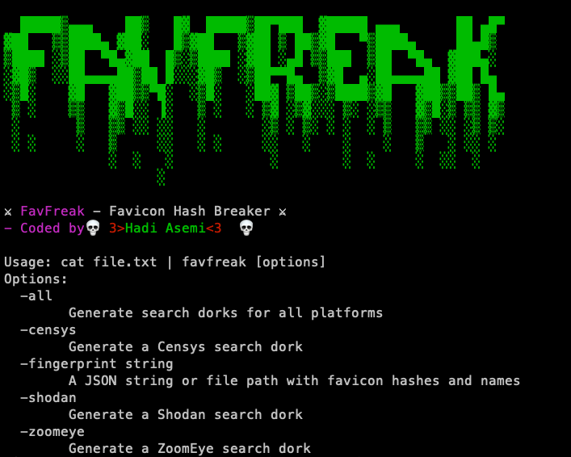

# **Favicon Hash Detection Tool for Bug Bounty Hunters**
---


## Introduction

**favfreak** is a tool designed to help bug bounty hunters identify websites using the same favicon across different domains. By generating unique hashes from favicons, you can uncover hidden infrastructure, find shadow IT assets, and increase your chances of discovering vulnerable services.

This tool supports search engines like **Shodan**, **ZoomEye**, and **Censys** to help you quickly and efficiently discover similar systems across the internet.

---

## Features

- **Generate Favicon Hashes** using MMH3 and MD5 algorithms.
- **Search Across Platforms** like Shodan, ZoomEye, and Censys using generated hashes.
- **Detect Shared Infrastructure** based on the same favicon hash across multiple domains.
- **Identify Shadow IT Assets** by detecting systems not directly linked from public sites.
- **Fingerprint-Based Detection** of technologies or services using favicon hashes.
  
---

## Installation

### 1. **Install Go**

favfreak is written in Go, so you'll need to install it first. Here’s how to install **Go** on your system:

#### **Linux / WSL:**
```bash
sudo apt update
sudo apt install golang-go
```

#### **macOS:**
```bash
brew install go
```

#### **Windows:**
Download the installer from the [official Go website](https://golang.org/dl/).

Verify the Go installation:

```bash
go version
```

### **Installition of favfreak**
```bash
go install github.com/Hadiasemi/favfreak@latest
```
---

## Usage

### 1. **Basic Favicon Hash Generation**

To generate the favicon hash for a target website, run the following command:

```bash
cat file.txt | favfreak
```

The tool will attempt to fetch the favicon from the target, calculate its **MMH3** and **MD5** hashes, and display the results.

### 2. **Search Dorks for Shodan, ZoomEye, and Censys**

favfreak can generate search dorks that you can directly use on **Shodan**, **ZoomEye**, and **Censys** to find other systems using the same favicon hash.

To generate dorks, run the following:

#### **Shodan:**
```bash
cat file.txt | favfreak -shodan
```

#### **ZoomEye:**
```bash
cat file.txt | favfreak -zoomeye
```

#### **Censys:**
```bash
cat file.txt | favfreak  -censys 
```

#### **Generate Dorks for All Platforms:**
```bash
cat file.txt | favfreak  -all
```

### 3. **Using Fingerprint-Based Detection**

One of the core features of favfreak is the ability to match favicon hashes to known services or technologies using a **fingerprint dictionary**.

#### **Example JSON Fingerprint File (fingerprints.json):**
```json
{
    "99395752": "slack-instance",
    "878647854": "atlasian"
}
```

You can run favfreak with a fingerprint file to detect known services:

```bash
favfreak -fingerprint fingerprints.json
```

This will show results like:

```
================= [FingerPrint Based Detection Results] =================
[slack-instance] - count: 1
[atlasian] - count: 2
```

You can also pass the fingerprint as a JSON string directly in the terminal:

```bash
favfreak -fingerprint '{"99395752": "slack-instance", "878647854": "atlasian"}'
```

---

## How Bug Bounty Hunters Can Benefit from favfreak

### 1. **Discover Shared Infrastructure**
Many companies use the same favicon across multiple domains. By identifying domains with the same favicon hash, you can map out a company's infrastructure, uncover hidden assets, and find more entry points for vulnerabilities.

### 2. **Identify Shadow IT Assets**
By using Shodan, ZoomEye, or Censys, you can identify services that may not be directly linked to the public-facing website. These shadow IT assets are often forgotten and more vulnerable.

### 3. **Infer Technology Stack**
Some favicons are tied to specific services or technologies. Using the fingerprint dictionary feature in favfreak, you can quickly identify services like Slack, Atlassian, or F5 Big-IP based on their favicon hashes.

---

## Example Workflow for Bug Bounty Hunters

1. **Identify Favicon Hash:**
   Start by generating a favicon hash for the target website using favfreak:

   ```bash
    cat file.txt | favfreak 
   ```

2. **Search Across Platforms:**
   Use the generated dorks to search Shodan, ZoomEye, and Censys for other domains or IP addresses that use the same favicon:

   ```bash
    cat file.txt | favfreak -all
   ```

3. **Map Out Infrastructure:**
   If you find other domains or IPs using the same favicon, investigate these targets as part of your bug bounty assessment. These services might be part of the company's infrastructure but are often overlooked or misconfigured.

4. **Leverage Fingerprint-Based Detection:**
   If you have known hashes for specific technologies or services, you can use the fingerprint-based detection feature to quickly identify them:

   ```bash
   cat file.txt | favfreak -fingerprint fingerprints.json
   ```

---

## Contribution

If you’d like to contribute to **favfreak**, feel free to submit a pull request or create an issue in the repository.

---


